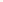

# A real affine (23₄) configuration

[](https://doi.org/10.5281/zenodo.22662692)
[](https://palomar-registry.org/entry.html?id=PALOMAR-2026-09-08-000004&version=1)

<p align="center">
  
</p>

There exist 23 distinct points and 23 distinct straight lines in the real
affine plane, with exactly four selected lines through each selected point
and exactly four selected points on each selected line.

This repository gives explicit rational coordinates and a Lean proof of
existence over the real numbers. The proof requires no search program,
numerical tolerance, census certificate or assumption about realizability.
The original audited `v1.0.1` existence snapshot is registered as
[PALOMAR-2026-09-08-000004 v1](https://palomar-registry.org/entry.html?id=PALOMAR-2026-09-08-000004&version=1).

## Independent work by Wenhao Lu

[Wenhao Lu](https://github.com/welu2027/23_4-configuration) (Millburn High
School) independently obtained the same two configurations and an independent
classification of the Klein-four-symmetric case. His route begins with a
finite-field CP-SAT search, followed by a `nauty` quotient enumeration and
exact Gröbner-basis calculations in Singular, replicated in Macaulay2. Lu first
contacted the maintainer on September 8, 2026, and communicated his draft on
September 9. He reports that the draft was written September 6 and submitted as
JMM 2027 abstract 66522 on September 7.

The rational witnesses agree after interchanging `y` and `z`; the quadratic
witnesses have isomorphic incidence types, and Lu's draft identifies them
projectively. Both exact witness checkers in Lu's public repository replayed
successfully here. See the [independent-work receipt](evidence/independent-work/README.md)
for the checked source revision and the precise scope of this comparison.

## Read the result

- [Challenge.lean](Challenge.lean): the independent statement, 35 lines.
- [Solution.lean](Solution.lean): the coordinates and complete proof, 93 lines.
- [PROOF.md](PROOF.md): a compact arithmetic proof using eight sign orbits.
- [STATEMENT_AUDIT.md](STATEMENT_AUDIT.md): how the formal conditions express
  distinct real points and straight lines with exact degree four.
- [coordinates.json](coordinates.json): the rational homogeneous witness from
  which the displayed affine coordinates were obtained.
- [exact-one-page.pdf](docs/exact-one-page.pdf): the correspondence-ready
  coordinate and orbit sheet.
- [all-finite-header.svg](assets/all-finite-header.svg): the exact, orbit-colored
  chart used above, with all 23 points visible. The line at infinity is
  `x + 3z = 0`; [configuration.svg](configuration.svg) gives another all-finite
  chart optimized for compact affine coordinates.

The deliberate hole in Challenge is a statement for Comparator to check.
Solution does not import Challenge and has no unproved declarations.
The kernel axiom dependencies are the standard `propext`, `Classical.choice`
and `Quot.sound`. A separate [Std-only integer certificate](standalone/Witness.lean)
uses ordinary `decide` and no axioms.

## Symmetric classification

The accompanying exact evidence establishes a broader bounded theorem: up to
real projective equivalence and incidence relabeling, exactly two geometric
`(23_4)` configurations admit a Klein four-group `V4` of collineations.  E1 is
the rational construction formalized here.  E2 is a projectively inequivalent
incidence type over `Q(sqrt(17))`; its two real embeddings are projectively
equivalent after relabeling, and its positive embedding has an explicitly
checked positive-definite self-polarity.

The [public evidence map](evidence/README.md) links the complete candidate-list
argument, the zero-failure replay of all 5,393 exclusions, exact decomposition
of the two surviving action loci, and the independent combinatorial audit.
It also includes the reconstructed CT1-S1 type from Cuntz's complex example:
CT1-S1 is nonisomorphic to E1 and E2 and its exact realization scheme has two
conjugate `Q(i)` points and no real point.

This theorem covers the V4 sector.  The `C2` and trivial-collineation sectors
remain outside the classification.

## Build

Install Lean's standard elan toolchain manager, then run:

```sh
lake exe cache get Mathlib.Data.Real.Basic Mathlib.Data.List.Pairwise Mathlib.Tactic.NormNum
lake build
lean standalone/Witness.lean
```

The project pins Lean 4.32.0 and the full Mathlib dependency graph. The
committed modules are self-contained; Python and the original research
repository are not needed for this Lean build.

For metadata validation, using Python 3.10 or later:

```sh
python3 -m venv .cache/metadata
.cache/metadata/bin/pip install -r requirements-validation.txt
.cache/metadata/bin/python scripts/check_metadata.py
```

For the independent exported-proof checks, use Linux with Git, Lean/Lake,
Go 1.24 or later and Rust/Cargo installed:

```sh
bash scripts/verify-comparator.sh
python3 scripts/negative_controls.py
```

The second command belongs in a disposable checkout. It deliberately changes
Solution temporarily, tests rejection, restores the exact original bytes and
rebuilds. Do not run it concurrently with an editor or build. The verifier
retains the Landrun sandbox restrictions and enables NanoDa. Exact tool pins,
executed results and limitations are in [VERIFICATION.md](VERIFICATION.md).
The included GitHub Actions workflow repeats these checks after export.

The short E2 and combinatorial checks can be replayed separately:

```sh
node evidence/e2/verify.mjs
python3 -m pip install -r evidence/requirements.txt
python3 evidence/combinatorics/audit_isomorphism.py
```

## Scope and provenance

The formal Lean theorem establishes existence over R for E1. Its explicit
witness has rational coordinates; rationality is not a separate quantified
Lean theorem. The V4 classification is supported by the separately identified
exact-computation evidence, rather than by Lean. No classification of all
geometric `(23_4)` configurations or publication-priority claim is made.
[LITERATURE.md](LITERATURE.md) records dated historical sources and the limits
of the present literature audit. The construction addresses the existence
question discussed by [Cuntz (2017/2018)](https://arxiv.org/abs/1705.00927).

Will Strinz directed the project and is the author and responsible maintainer.
Codex assisted discovery, exact checks, formalization and packaging.
[formalization.yaml](formalization.yaml) discloses sources, automation and
review. Palomar's automated editorial review found no blocking problem, warning
or requested change for the registered `v1.0.1` snapshot. There has been no
independent human peer review.
The project is MIT licensed; third-party materials retain the licenses
listed in [THIRD_PARTY.md](THIRD_PARTY.md).

## Release and submission

This is the focused public repository for the construction and formal proof.
See [SUBMISSION.md](SUBMISSION.md) for the export, verification and registration
record.

## Citation and sharing

The continuing project has concept DOI
[10.5281/zenodo.22662692](https://doi.org/10.5281/zenodo.22662692).
The Palomar-registered existence release, `v1.0.1`, is archived as
[10.5281/zenodo.22663385](https://doi.org/10.5281/zenodo.22663385).
Release `v1.1.0` adds the public V4-classification evidence and is archived as
[10.5281/zenodo.22666118](https://doi.org/10.5281/zenodo.22666118). The concept
DOI above always resolves to the newest archived release. See
[ZENODO.md](ZENODO.md) and [CITATION.cff](CITATION.cff) for details, and
[RELEASES.md](RELEASES.md) for the evidence-release notes.
The [generated sharing cover](assets/sharing-cover.png) is available with its
[prompt and provenance](assets/README.md). The exact construction is also
available as a text-free [1500 x 900 PNG](assets/all-finite-header.png) for
sharing; use [the corresponding SVG](assets/all-finite-header.svg) when a
scalable figure is preferable.
